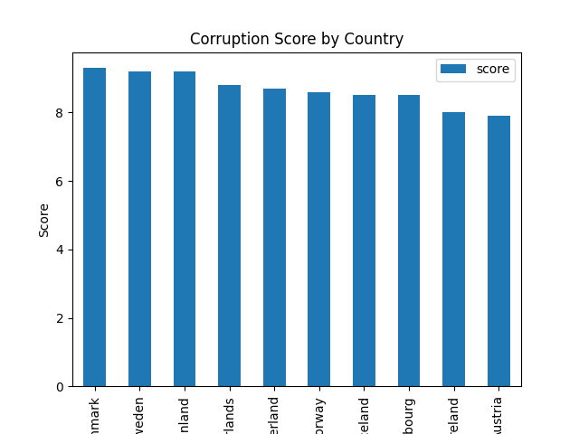
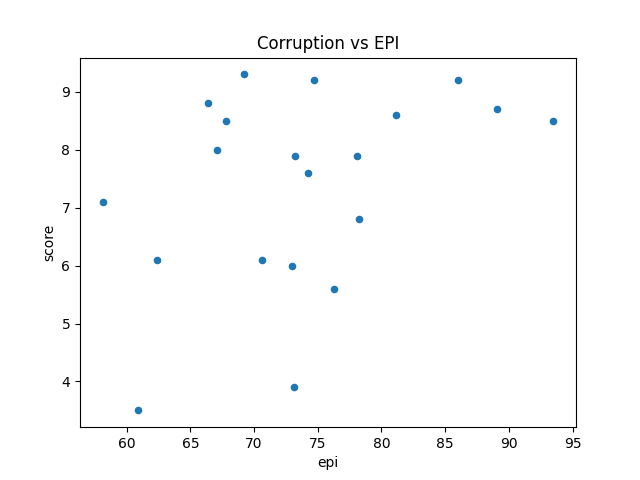

Environmental Performance Index (EPI) & Corruption

Introduction
This project analyzes the relationship between the Environmental Performance Index (EPI) and corruption, with a focus on Western Europe. I choose corruption because it would be interesting to see if there were any relation between a corrupt government and the Environmental score a nation recieved. 

Data

The data used for this project is the EPI scores, in regards to different catergories such as fisheries, water, air pollution etc, and the corruption index is a ranking given to nations with a higher number being a hgiher corruption status.

Methodology

The EPI data is loaded into a SQL database using SQLAlchemy. From there I pull in the data from SQL to my Python notebook. I then use the Corruption CSV to create a dataframe. This dataframe is also pushed to my SQL library. Once i have both data sets saved, I create both in a DF and start to compare the data. 

Results

The results are displayed in a bar plot, where the countries are sorted by their corruption score. Additionally, scatter plots are created to visualize the relationship between the EPI score and corruption score, as well as the relationship between the EPI score and water health.

